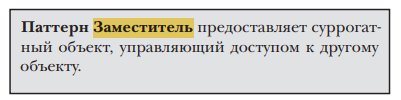
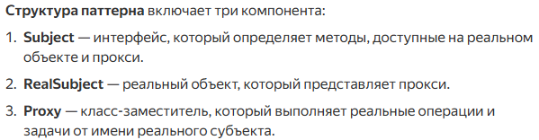
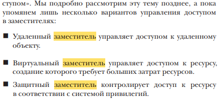
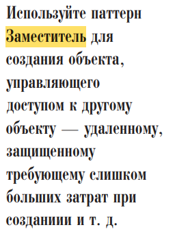
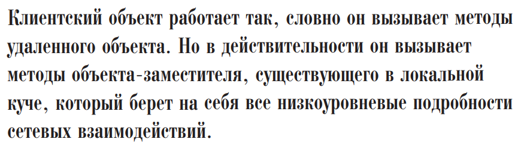
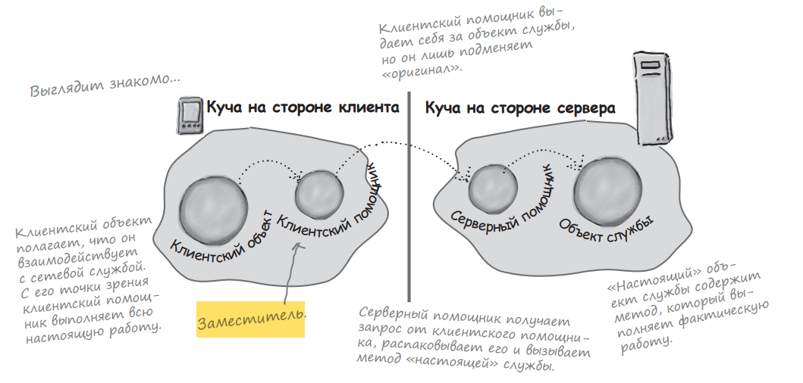
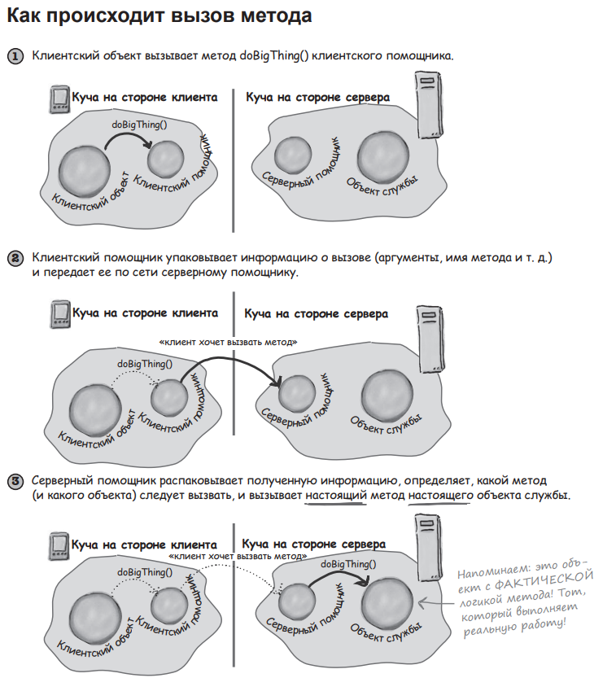
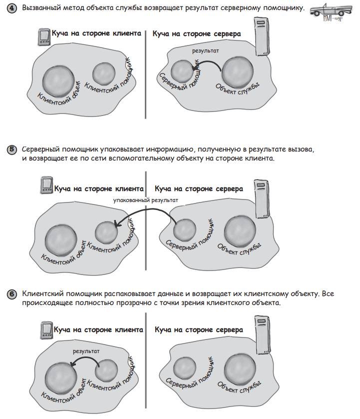

Коротко: Используем паттерн прокси, когда хотим получить объект, который будет выступать в качестве заместителя
другого объекта. То есть прокси - некая обёртка нашего объекта, которая позволяет управлять доступом к оригинальному
объекту 

