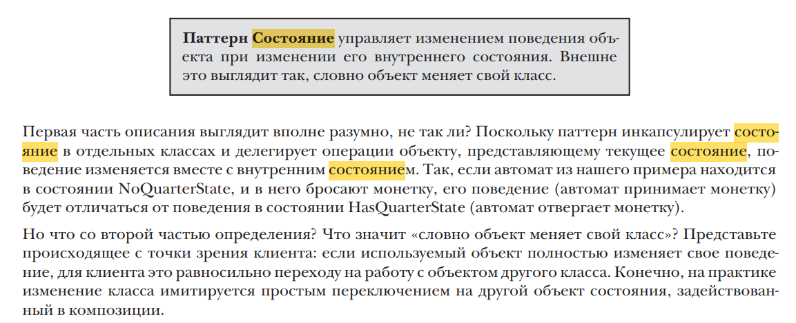
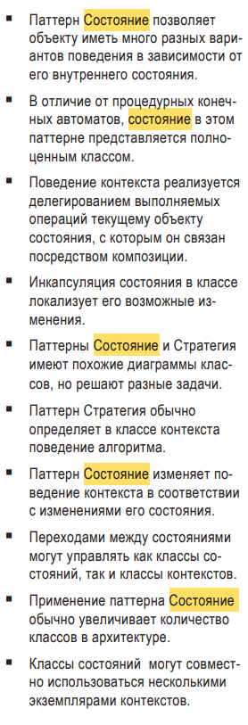
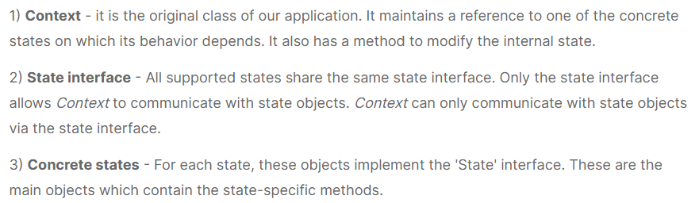

Коротко: паттерн реализует структуру, в которой при изменении какого-то параметра объекта меняется то, как он будет 
обрабатывать поступающие в него запросы. Короче меняет свой функционал в зависимости от значений параметров

