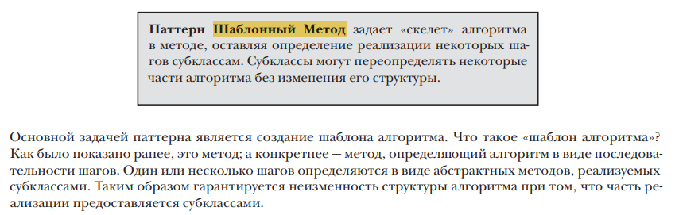
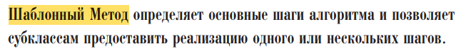
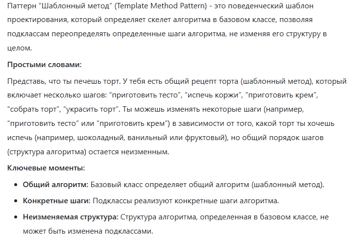
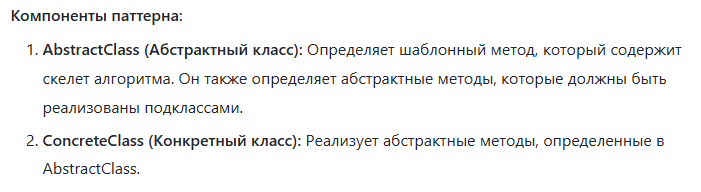
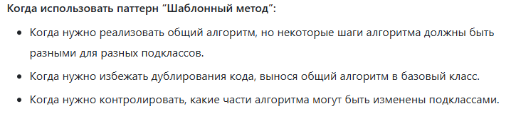

Коротко: Мы создаём абстрактный класс, в котором определяем скелет алгоритма, например, порядок выполнения функций
При этом позволяя подклассам переопределять определённые шаги алгоритма, не изменяя его структуру

